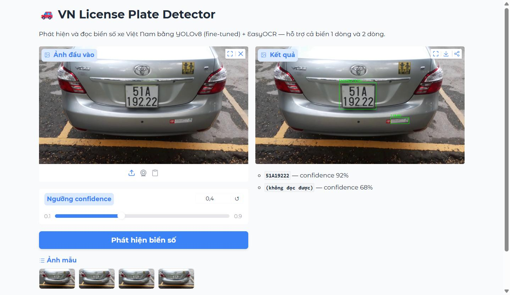

# VN License Plate Detector

[](https://github.com/lybii/vn-license-plate-detector/actions/workflows/tests.yml)
[](LICENSE)


Phát hiện và nhận diện biển số xe Việt Nam: fine-tune YOLOv8 để xác định vị trí biển số, sau đó dùng OCR để đọc nội dung.



Tài liệu thiết kế chi tiết: [`docs/architecture.md`](docs/architecture.md), [`docs/dataset.md`](docs/dataset.md), [`docs/pipeline.md`](docs/pipeline.md), [`docs/roadmap.md`](docs/roadmap.md).

## Cấu trúc thư mục

```
configs/          File cấu hình train/inference
data/
  raw/             Dataset gốc tải về (không commit)
  processed/       Dataset đã xử lý/chia split (không commit)
  eval/            Ground truth gán tay để đánh giá accuracy
notebooks/         Notebook train trên Colab (GPU)
pyproject.toml     Đóng gói src/plate_detector thành package pip-installable
src/
  data/            Script tải & xử lý dataset
  plate_detector/  Package chính: detect.py, ocr.py, track.py, preprocess.py, pipeline.py (PlateReader)
  app/             Demo app (Gradio)
  eval/            Script đánh giá độ chính xác (so với ground truth gán tay)
models/            Trọng số model đã train (không commit)
tests/             Unit test
docs/              Tài liệu kiến trúc & kế hoạch
```

## Cài đặt

```bash
python -m venv .venv
.venv\Scripts\activate       # Windows
pip install -r requirements.txt
pip install -e .             # cài package plate_detector ở chế độ editable
```

Dùng virtual environment riêng (`.venv/`, đã có trong `.gitignore`) để tránh xung đột phiên bản package (numpy, v.v.) với các project Python khác trên máy.

## Tải dataset

```bash
python src/data/download.py
```

Script tải dataset [`bomaich/vnlicenseplate`](https://www.kaggle.com/datasets/bomaich/vnlicenseplate) qua `kagglehub`, cần có Kaggle API credentials (`~/.kaggle/kaggle.json`, lấy tại Kaggle → Account → Create New API Token). Dataset được lưu vào `data/raw/vnlicenseplate/`.

## Trạng thái

- [x] Khung thư mục + tài liệu kiến trúc
- [x] Chọn dataset, tải dataset về `data/raw/vnlicenseplate/` (381 train / 109 valid / 8 test ảnh)
- [x] Viết `configs/data.yaml`, `configs/train_config.yaml`, `notebooks/train_colab.ipynb`
- [x] Train baseline trên Colab — precision 0.997, recall 1.0, mAP50 0.995 (xem `docs/pipeline.md`)
- [x] Inference pipeline (`src/plate_detector/detect.py` + `ocr.py`), test trên 8 ảnh — đọc đúng biển 7/8 frame
- [x] Demo app (`src/app/demo.py`, Gradio) — đã test qua API thật, hoạt động đúng
- [x] Xác nhận logic đọc biển 2 dòng (xe máy) đúng trên ảnh thật
- [x] Multi-frame tracking + voting (`src/plate_detector/track.py`) — bù lỗi OCR từng frame bằng cách vote đa số qua nhiều frame: per-frame 87.5% đúng → sau voting 100%
- [x] Evaluation script (`src/eval/evaluate.py`) — ground truth đã mở rộng lên **52 ảnh đa dạng**: exact-match **32.7%**, character accuracy **83.1%** (số liệu ban đầu 77.8%/94.6% trên 9 ảnh bị thiên lệch do gần hết là frame của 1 biển dễ đọc; số mới cho thấy OCR là điểm yếu chính, đặc biệt lỗi hệ thống nhầm `5`↔`6` — xem `docs/pipeline.md`)
- [x] Unit test cho toàn bộ logic thuần (`tests/`, 22 test case, chạy `pytest`)
- [x] Đóng gói `plate_detector` thành package pip-installable + `PlateReader` facade, làm lại demo UI bằng `gr.Blocks`
- [x] Classical image processing (`src/plate_detector/preprocess.py`: CLAHE, deskew, Otsu binarize) — đo thực nghiệm, quyết định không dùng binarize mặc định vì làm giảm accuracy với EasyOCR (xem `docs/pipeline.md`)

## Chạy demo

Cần có `models/best.pt` — tải từ [GitHub Releases](https://github.com/lybii/vn-license-plate-detector/releases/tag/v0.1.0) (không cần tự train lại), đặt vào `models/best.pt`.

```bash
python src/app/demo.py
```

Mở `http://127.0.0.1:7860` trên trình duyệt, upload ảnh xe để xem kết quả phát hiện + đọc biển số.

## Đánh giá độ chính xác

```bash
python src/eval/evaluate.py
```

## Chạy tracking + voting trên nhiều frame

```bash
python src/plate_detector/track.py <thư mục ảnh chứa các frame liên tiếp>
```

Xem chi tiết lộ trình tại [`docs/roadmap.md`](docs/roadmap.md).

## License

Code trong repo này dùng giấy phép [MIT](LICENSE). Dataset ([`bomaich/vnlicenseplate`](https://www.kaggle.com/datasets/bomaich/vnlicenseplate) trên Kaggle) và trọng số model **không** nằm trong giấy phép này — không được commit vào repo và giữ nguyên điều khoản sử dụng gốc của Kaggle.
