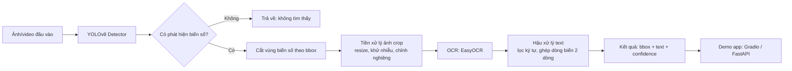
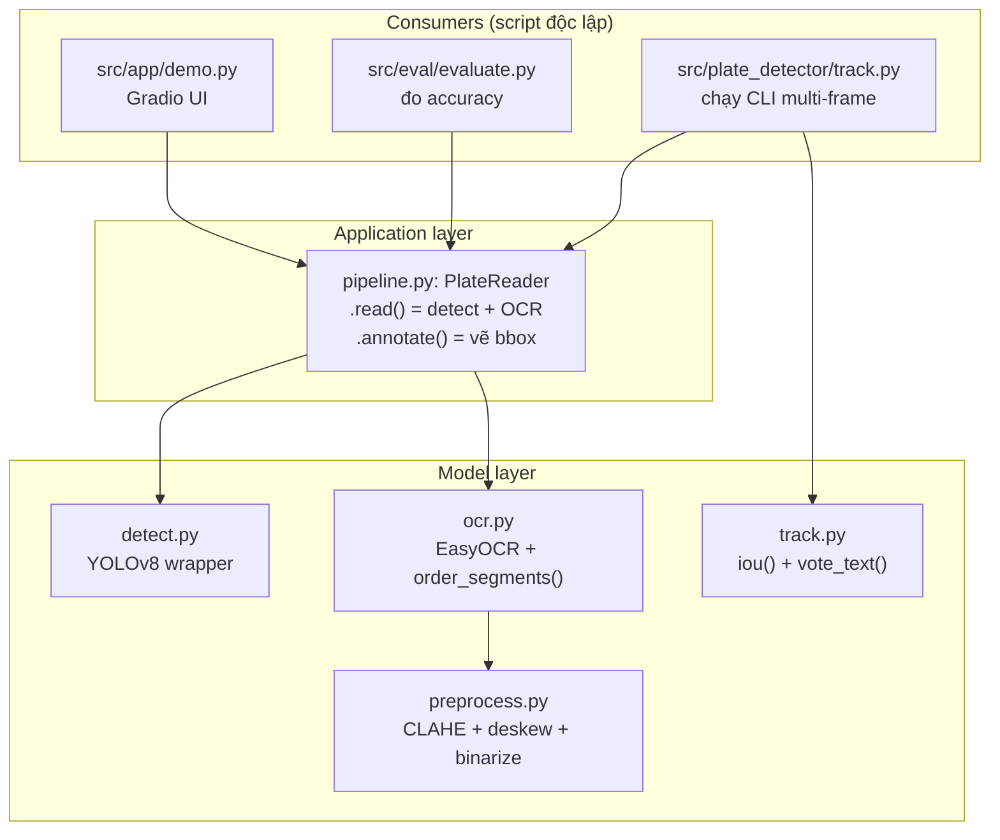

# Kiến trúc hệ thống

## Tổng quan

Dự án nhận diện biển số xe Việt Nam, gồm 2 giai đoạn chính: **phát hiện vị trí biển số** (object detection) và **đọc nội dung biển số** (OCR). Ảnh/khung hình đầu vào đi qua detector YOLOv8 để xác định vùng chứa biển số, vùng này được cắt ra và đưa vào OCR để trích xuất chuỗi ký tự, cuối cùng kết quả được hiển thị qua một demo app.

## Sơ đồ layer trong code (`src/plate_detector/`)

Toàn bộ logic detect + OCR được đóng gói thành 1 package Python pip-installable (`plate_detector`), có 2 layer rõ ràng — các "consumer" (demo app, eval script, script tracking) không tự lặp lại logic detect+OCR mà đều gọi qua 1 facade chung:

**Vì sao đóng gói thành package thay vì để rời từng file**: ban đầu `demo.py`, `evaluate.py`, và phần `__main__` của `ocr.py`/`track.py` mỗi nơi tự `sys.path.insert(...)` để import chéo module ở thư mục khác — dễ vỡ khi đổi working directory, không phải cách Python project chuyên nghiệp tổ chức. Thêm `pyproject.toml` ở root và cài `pip install -e .` giúp mọi nơi import tuyệt đối `from plate_detector.xxx import yyy`, không cần path hack. Đồng thời logic "detect rồi OCR từng bbox" (từng bị lặp lại y hệt ở 3 file) được gom vào 1 class `PlateReader` duy nhất trong `pipeline.py`.

## Vì sao tách 2 giai đoạn (detect rồi mới OCR) thay vì end-to-end 1 model

- Chạy OCR trực tiếp trên cả bức ảnh gốc sẽ rất chậm và dễ đọc nhầm chữ ở các vùng không liên quan (biển quảng cáo, chữ trên xe...).
- Tách detector riêng giúp tận dụng được model pretrained mạnh (YOLOv8 pretrained trên COCO) và chỉ cần fine-tune với lượng dữ liệu vừa phải để nhận ra 1 class duy nhất (`plate`), thay vì phải train từ đầu.
- OCR chỉ cần chạy trên vùng ảnh nhỏ đã crop → nhanh hơn nhiều và độ chính xác đọc chữ cao hơn vì ảnh input "sạch", ít nhiễu nền.

## Các thành phần chính

### 1. Dataset preparation — `src/data/`

Chịu trách nhiệm tải dataset công khai về, chuyển đổi annotation sang định dạng YOLO, và chia tập train/val/test. Chi tiết xem [`docs/dataset.md`](dataset.md).

### 2. Detector (YOLOv8) — `src/train/`, `notebooks/`

Fine-tune model YOLOv8 pretrained (Ultralytics) trên dataset biển số VN, huấn luyện trên Google Colab (có GPU miễn phí). Output là file trọng số `best.pt` được tải về `models/`. Chi tiết xem [`docs/pipeline.md`](pipeline.md).

### 3. Inference pipeline — `src/plate_detector/`

Package pip-installable (`pip install -e .`), gồm:
- `detect.py`: load `models/best.pt`, chạy detection trên ảnh, trả về danh sách bounding box + confidence. Nhận tham số `conf` override (UI dùng để làm slider điều chỉnh ngưỡng).
- `preprocess.py`: các kỹ thuật classical image processing (CLAHE, deskew qua `minAreaRect`, Otsu binarize) áp dụng lên ảnh crop trước khi OCR. Xem thực nghiệm đo tác động ở [`docs/pipeline.md`](pipeline.md).
- `ocr.py`: nhận bounding box, crop ảnh, gọi `preprocess.py`, chạy EasyOCR, hậu xử lý chuỗi kết quả (loại ký tự lạ, xử lý biển số 2 dòng phổ biến ở xe máy VN).
- `pipeline.py`: class `PlateReader` — facade gọi `detect.py` + `ocr.py` cho từng ảnh (`.read()`), và vẽ kết quả lên ảnh (`.annotate()`). Đây là điểm vào chung cho mọi consumer (demo, eval, track).

### 4. Demo app — `src/app/`

Giao diện Gradio (`gr.Blocks`, custom theme) để upload ảnh và xem kết quả: ảnh vẽ bbox + text nhận diện dạng Markdown, slider chỉnh ngưỡng confidence trực tiếp, ảnh mẫu để bấm thử nhanh, accordion giải thích cách hoạt động. Dùng `PlateReader` từ `plate_detector.pipeline`, không tự lặp lại logic detect+OCR. Có thể bổ sung thêm FastAPI nếu cần expose REST API (`POST /detect`) cho mục đích tích hợp.

### 5. Multi-frame tracking & voting — `src/plate_detector/track.py`

Khi input là chuỗi frame liên tiếp (video/clip camera) thay vì 1 ảnh đơn lẻ, mỗi frame OCR độc lập có thể đọc sai khác nhau (mất 1 ký tự, nhầm ký tự). Module này:
- Ghép các detection cùng 1 biển số qua nhiều frame bằng IoU (`iou()`), theo kiểu tracker đơn giản (không dùng thuật toán tracking phức tạp như Kalman/Hungarian vì bài toán chỉ cần "đủ tốt" cho demo).
- Với mỗi track, "vote" ra 1 chuỗi text đồng thuận (`vote_text()`): chọn độ dài phổ biến nhất trong các lần đọc, rồi vote ký tự theo từng vị trí — giúp loại bỏ lỗi đọc lẻ tẻ ở từng frame riêng.
- Kết quả thực nghiệm trên 8 frame test: 7/8 frame đọc đúng riêng lẻ, nhưng **voted text đạt đúng 100%** (bù được frame bị thiếu ký tự). Xem chi tiết `docs/pipeline.md`.

### 6. Evaluation — `src/eval/evaluate.py`

Đo độ chính xác pipeline detect+OCR so với ground truth gán nhãn thủ công (`data/eval/ground_truth.json`, gồm bbox + text đúng cho từng ảnh). Match detection với ground truth bbox bằng IoU (không chọn theo confidence cao nhất) vì một số ảnh có nhiều biển số/false-positive — chọn theo confidence sẽ dễ so sánh nhầm biển. Báo cáo exact-match accuracy và character-level accuracy.

## Lựa chọn công nghệ và lý do

| Thành phần | Lựa chọn | Vì sao |
|---|---|---|
| Detector | YOLOv8 (Ultralytics), bắt đầu với `yolov8n` | Nhẹ, train nhanh trên Colab free GPU, cộng đồng lớn, dễ export sang ONNX/ncnn nếu sau này cần deploy mobile/edge |
| OCR | EasyOCR | Hỗ trợ sẵn, dễ dùng, hỗ trợ tiếng Anh/số tốt (biển số VN chủ yếu là chữ số + chữ cái Latin); có thể thay bằng PaddleOCR nếu cần độ chính xác cao hơn |
| Demo | Gradio | Dựng UI nhanh chỉ vài dòng code, phù hợp để quay demo video/screenshot cho portfolio |
| Training env | Google Colab | Máy local chỉ có PyTorch bản CPU, chưa cấu hình CUDA; Colab cho GPU miễn phí đủ dùng cho fine-tune YOLOv8n/s |

## Luồng dữ liệu khi training

1. `src/data/download.py` tải dataset gốc về `data/raw/`.
2. Script/notebook chuyển annotation gốc (VOC XML/COCO JSON/CSV tùy dataset) sang YOLO format, chia train/val/test, lưu vào `data/processed/` kèm file `data.yaml`.
3. `notebooks/train_colab.ipynb` chạy trên Colab: tải `data/processed/` lên (hoặc tải trực tiếp từ nguồn), fine-tune YOLOv8 theo cấu hình trong `configs/train_config.yaml`.
4. Sau khi train xong, đánh giá mAP/precision/recall trên tập val, tải file `best.pt` về `models/`.

## Luồng dữ liệu khi inference (chạy local)

1. `PlateReader.read()` (`src/plate_detector/pipeline.py`) gọi `detect.py` để lấy list bbox biển số, rồi gọi `ocr.py` để đọc text từng bbox.
2. `PlateReader.annotate()` vẽ bbox + text lên ảnh.
3. `src/app/demo.py` gọi `PlateReader` và hiển thị kết quả trực quan qua Gradio. `src/eval/evaluate.py` và `src/plate_detector/track.py` cũng dùng chung `PlateReader` thay vì tự viết lại logic.

## Ràng buộc hiệu năng (mục tiêu tham khảo, sẽ tinh chỉnh sau khi có kết quả thực tế)

- Inference trên CPU: chấp nhận được nếu xử lý 1 ảnh trong vài giây (không yêu cầu real-time ở bản demo đầu tiên).
- Nếu sau này muốn real-time (video webcam), sẽ cần export model sang ONNX/TensorRT và cân nhắc chạy trên GPU local hoặc giảm kích thước model.

## Hướng mở rộng trong tương lai (chưa làm ở giai đoạn hiện tại)

- Thêm nhận diện loại xe (ô tô/xe máy) để áp dụng logic đọc biển 1 dòng/2 dòng khác nhau.
- Deploy model dưới dạng API để tích hợp vào hệ thống bãi xe/giám sát giao thông mô phỏng.
- Áp dụng thêm augmentation mô phỏng điều kiện thực tế (mờ, ngược sáng, mưa) để tăng độ bền vững của model.
